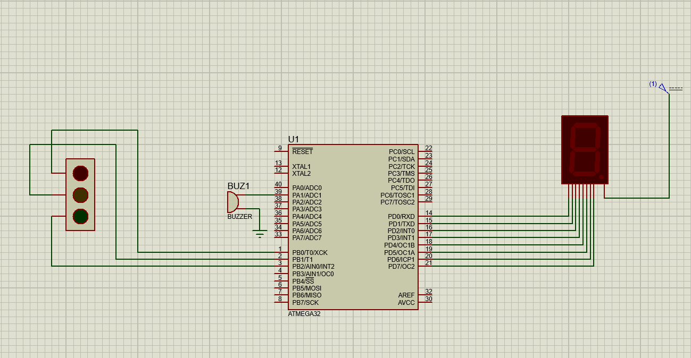

# 🚦 Traffic Light System using ATmega32

## 📌 Overview
This project implements a simple **traffic light system** using the ATmega32 microcontroller. The system controls **Red, Yellow, and Green LEDs** to simulate a real-world traffic light. A **buzzer** is also included to signal when necessary.

## 🛠️ Components Used
- **🖥️ Microcontroller:** ATmega32
- **💡 LEDs:** Red, Yellow, Green
- **🔊 Buzzer**
- **🔢 7-Segment Common Anode Display**
- **🔌 Programmer:** ISP or Arduino as ISP
- **⚡ Power Supply**
- **🛠️ Resistors & Connecting Wires**

## 🏗️ Circuit Diagram

The circuit consists of:
1. **🚦 Traffic Lights:** Three LEDs connected to ATmega32.
2. **🔊 Buzzer:** Alerts users when necessary.
3. **🔢 7-Segment Display:** Displays countdown (if implemented).

### 🟢 Traffic Light Sequence
1. **🔴 Red LED ON** → Stop 🚗
2. **🟡 Yellow LED ON** → Wait ⏳
3. **🟢 Green LED ON** → Go ✅

## ⚙️ Pin Configuration

| Component        | Port & Pin |
|-----------------|-----------|
| **Seven Segment Display** | PORTD (PD0-PD7) |
| **🔴 Red LED**   | PB0       |
| **🟡 Yellow LED** | PB1       |
| **🟢 Green LED**  | PB2       |
| **🔊 Buzzer** (Positive) | PA1       |
| **🔊 Buzzer** (Negative) | GND       |

## 🏗️ Working Principle
The ATmega32 is programmed to cycle through the traffic light sequence at predefined intervals. Each LED turns **ON and OFF** in sequence, mimicking a real traffic signal. The **buzzer provides an audio alert** when needed.

## 🖥️ Code Implementation
The microcontroller is programmed in **C using AVR-GCC**, or in the **Arduino environment** if using an **Arduino as ISP**. The logic follows a **timed delay approach** to switch LEDs sequentially.

## 🚀 Future Enhancements
- 🖥️ Adding an **LCD display** for better visibility of the countdown timer.
- 🚶 Implementing an **IR sensor** for pedestrian crossing control.
- 🚑 Integrating an **RFID module** for emergency vehicle prioritization.

## ▶️ How to Run
1. 🔌 Upload the program to the ATmega32 using a suitable **programmer**.
2. ⚡ Power the circuit with a **5V supply**.
3. 👀 Observe the **traffic light sequence**.
